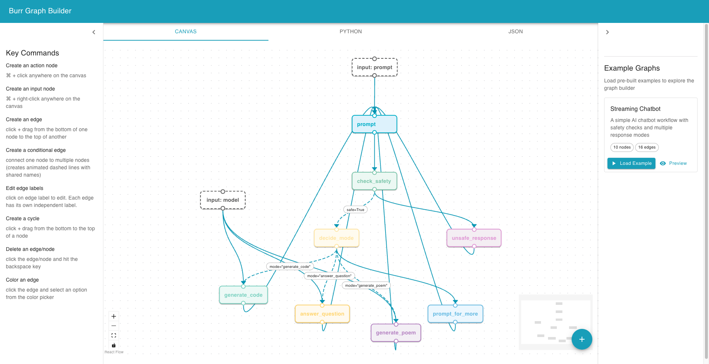

# Burr Graph Builder

A visual graph builder for creating [Burr](https://github.com/DAGWorks-Inc/burr) workflows with an intuitive drag-and-drop interface. Build complex state machine workflows visually and export them as boilerplate Burr Graph in Python.



## Generates the boilerplate Burr Graph in Python 

```python
from typing import Tuple
from burr.core import State, default, when
from burr.core.action import action
from burr.core.graph import GraphBuilder

@action(reads=[], writes=[])
def prompt(state: State, prompt: str) -> Tuple[dict, State]:
    """This is a stub implementation. Please complete this action with your business logic."""
    return {}, state

@action(reads=[], writes=[])
def check_safety(state: State) -> Tuple[dict, State]:
    """This is a stub implementation. Please complete this action with your business logic."""
    return {}, state

@action(reads=[], writes=[])
def decide_mode(state: State) -> Tuple[dict, State]:
    """This is a stub implementation. Please complete this action with your business logic."""
    return {}, state

@action(reads=[], writes=[])
def unsafe_response(state: State) -> Tuple[dict, State]:
    """This is a stub implementation. Please complete this action with your business logic."""
    return {}, state

@action(reads=[], writes=[])
def generate_code(state: State, model: str) -> Tuple[dict, State]:
    """This is a stub implementation. Please complete this action with your business logic."""
    return {}, state

@action(reads=[], writes=[])
def answer_question(state: State, model: str) -> Tuple[dict, State]:
    """This is a stub implementation. Please complete this action with your business logic."""
    return {}, state

@action(reads=[], writes=[])
def generate_poem(state: State, model: str) -> Tuple[dict, State]:
    """This is a stub implementation. Please complete this action with your business logic."""
    return {}, state

@action(reads=[], writes=[])
def prompt_for_more(state: State) -> Tuple[dict, State]:
    """This is a stub implementation. Please complete this action with your business logic."""
    return {}, state

def create_burr_graph():
    """Create the Burr graph for the project."""
    return (
        GraphBuilder()
        .with_actions(
          prompt,
          check_safety,
          decide_mode,
          unsafe_response,
          generate_code,
          answer_question,
          generate_poem,
          prompt_for_more,
        )
        .with_transitions(
            ("prompt", "check_safety", default),
            ("check_safety", "decide_mode", when(safe_true=True)),
            ("check_safety", "unsafe_response", default),
            ("decide_mode", "generate_code", when(mode_generate_code=True)),
            ("decide_mode", "answer_question", when(mode_answer_question=True)),
            ("decide_mode", "generate_poem", when(mode_generate_poem=True)),
            ("decide_mode", "prompt_for_more", default),
            ("generate_code", "prompt", default),
            ("answer_question", "prompt", default),
            ("generate_poem", "prompt", default),
            ("unsafe_response", "prompt", default),
            ("prompt_for_more", "prompt", default),
        )
        .build()
    )

graph = create_burr_graph()

if __name__ == "__main__":
    print("Burr graph created successfully.")
    print(graph)
    # You can now use `graph` in your Burr application.
```

## Features

- **Visual Workflow Design**: Create Burr workflows using an intuitive ReactFlow-based interface
- **Node Types**: Support for input nodes (parameters) and process nodes (actions)
- **Smart Code Generation**: Automatically generates Python code with proper action signatures including input parameters
- **Example Gallery**: Pre-built workflow examples to get you started quickly
- **Real-time Editing**: Edit node labels and descriptions directly in the graph
- **Export Options**: Export workflows as Python code or JSON format
- **Input Node Intelligence**: Input nodes are treated as parameters to target actions, not separate actions
- **Visual Flow Indicators**: Edges display arrow heads pointing to target nodes for clear flow direction
- **Keyboard Shortcuts**: Quick node creation with Cmd+Click (process nodes) and Cmd+Right-Click (input nodes)

## Getting Started

### Prerequisites

- Node.js 18+ 
- npm or yarn
- Python 3.11+ (for running generated Burr workflows)

### Installation

1. Clone the repository:
```bash
git clone <repository-url>
cd burr_graph_builder
```

2. Install frontend dependencies:
```bash
npm install
```

3. Install Python dependencies (optional, for testing generated workflows):
```bash
uv sync
```

4. Start the development server:
```bash
npm start
```

5. Open your browser and navigate to `http://localhost:3000`

## How to Use

### Creating a New Workflow

1. **Start Building**: Begin by adding nodes to the canvas using keyboard shortcuts
2. **Add Process Nodes**: Cmd+Click anywhere on the canvas to create process nodes (Burr actions)
3. **Add Input Nodes**: Cmd+Right-Click anywhere on the canvas to create input nodes (parameters)
4. **Connect Nodes**: Draw edges between nodes to define the workflow flow (edges show arrow heads pointing to target nodes)
5. **Add Conditions**: For conditional edges, add condition labels for decision logic

### Node Types

#### Input Nodes
- **Appearance**: Mid-gray dashed rectangles with white backgrounds
- **Purpose**: Represent parameters/inputs to actions
- **Naming Convention**: Use format like "input: prompt" or "input: model"
- **Code Generation**: Become parameters in the target action function signature

#### Process Nodes  
- **Appearance**: Colored solid rectangles with pastel backgrounds
- **Purpose**: Represent Burr actions that perform business logic
- **Code Generation**: Become `@action` decorated functions

### Example Workflow

The application includes a streaming chatbot workflow example that demonstrates:
- Input parameters (prompt, model)
- Safety checking
- Conditional logic for different response modes
- Return loops for continuous interaction

### Code Generation

When you export your workflow, the application generates:

1. **Action Functions**: Each process node becomes a Burr action with proper parameters:
```python
@action(reads=[], writes=[])
def prompt(state: State, prompt: str) -> Tuple[dict, State]:
    """This is a stub implementation. Please complete this action with your business logic."""
    return {}, state
```

2. **Graph Builder**: A function that constructs the Burr graph with all transitions:
```python
def create_burr_graph():
    """Create the Burr graph for the project."""
    return (
        GraphBuilder()
        .with_actions(prompt, check_safety, decide_mode, ...)
        .with_transitions(
            ("prompt", "check_safety", default),
            ("check_safety", "decide_mode", when(safe_true=True)),
            # ... more transitions
        )
        .build()
    )
```

3. **Stub Documentation**: All generated functions include docstrings indicating they need completion

## Workflow Design Best Practices

### Input Nodes
- Use descriptive names like "input: user_message" or "input: model_name"
- Connect input nodes directly to the process nodes that need those parameters
- Input nodes don't need outgoing connections to multiple nodes

### Process Nodes  
- Use clear, action-oriented names like "validate_input", "generate_response"
- Add descriptions to document what each action should do
- Consider the data flow between actions

### Conditional Logic
- Use descriptive condition names like "is_safe", "mode_generate_code"
- Group related conditional edges for better organization
- Always provide a default path for unmatched conditions

## Export Options

### Python Code Export
- Generates complete Burr workflow code
- Includes all necessary imports
- Creates stub functions ready for implementation
- Preserves workflow structure and conditions

### JSON Export  
- Exports workflow definition as structured JSON
- Useful for version control and sharing
- Can be imported back into the graph builder

## Development

### Available Scripts

- `npm start` - Start development server
- `npm run build` - Build for production
- `npm test` - Run tests
- `npm run eject` - Eject from Create React App (use with caution)

### Technology Stack

- **Frontend**: React 18 + TypeScript + Create React App
- **Graph Library**: @xyflow/react (ReactFlow)
- **UI Components**: Material-UI (MUI)
- **Styling**: CSS-in-JS with MUI's sx prop

### Project Structure

```
src/
├── components/
│   ├── CustomNode.tsx       # Node rendering component
│   ├── CustomEdge.tsx       # Edge rendering component
│   ├── GraphBuilder.tsx     # Main graph interface
│   ├── ExampleGallery.tsx   # Example workflows gallery
│   └── ConfirmLoadExampleDialog.tsx
├── data/
│   └── examples.ts          # Pre-built workflow examples
├── utils/
│   ├── BurrCodeGenerator.ts # Python code generation
│   ├── GraphExporter.ts     # JSON export functionality
│   └── ExampleLoader.ts     # Example loading utilities
└── App.tsx                  # Main application component
```

## Contributing

1. Fork the repository
2. Create a feature branch: `git checkout -b feature/amazing-feature`
3. Commit your changes: `git commit -m 'Add amazing feature'`
4. Push to the branch: `git push origin feature/amazing-feature`
5. Open a Pull Request

## Integration with Burr

The generated Python code is designed to work seamlessly with Burr:

1. **Install Burr**: `pip install burr[start]`
2. **Use Generated Code**: Copy the exported Python code to your project
3. **Implement Actions**: Replace stub implementations with your business logic
4. **Run Workflow**: Use Burr's execution engine to run your workflow

Example integration:
```python
from burr.core import Application

# Your generated create_burr_graph function
graph = create_burr_graph()

# Create and run application
app = Application.from_graph(
    graph=graph,
    initial_state={},
)

# Execute the workflow
action, result, state = app.run(halt_after=['final_action'])
```
## License

This project is licensed under the MIT License - see the LICENSE file for details.

## Related Links

- [Burr Documentation](https://burr.dagworks.io/)
- [ReactFlow Documentation](https://reactflow.dev/)
- [Burr GitHub Repository](https://github.com/DAGWorks-Inc/burr)